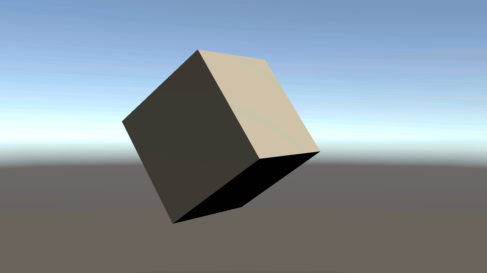
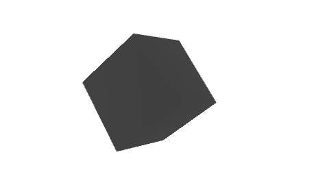
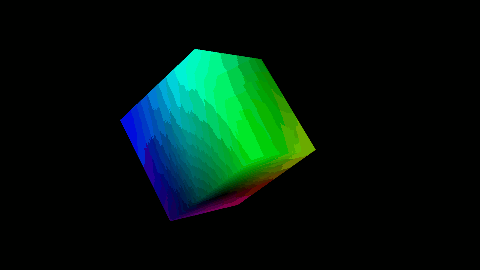

## Extracting Depth and Motion Vectors from Unity at runtime.

### Output

#### View 

#### Downscaled depth 

#### Downscaled motion vectors 

### Research

#### To do

A) IO and plug-in considerations

- [x] Look for alternatives to Replaced Shaders with our constraints.
- [x] Automatically save each type of RenderTextures inside folders.

B) Shader Replacement

- [ ] Look for documentation on RenderType (seems to be only a keyword in some JSON data), find out under which category do UI elements generally fall.

C) Command Buffers
- [x] Render Depth and View with Command Buffers inside Render Textures.
- [x] Render Motion Vectors.
- [ ] Compare results with some ground truth.

D) Render Piplines considerations
- [x] Support Legacy Render Pipleline.
- [ ] Support Universal Render Pipleline.
- [ ] Support High-Definition Render Pipleline.
- [ ] Support any other Scriptable Render Pipleline.

#### Constraints

* Default depth texture mode in Unity does not render some objects.[^1]
	* whose material's shader has no shader caster pass. (might be an issue)
	* not opaque (render queue > 2500)

* The depth texture we use should have transparent objects in it.
  * The depth component is used in the network as a classifier:
    * closer objects are upscaled in finer details than farther ones.
    * if an object's fragment crosses another object's in camera space,
		it is the closer one which should rendered. When rendering a
		frame full-scale, this is taken care of by the rendering back-end.
		However, in our case the overlap information will be partial
		in a lower-sampled image, so we need to be able to resolve it
		in the upscaled output.
  * Therefore, even transparent object should be rendered in this texture
	because they hold the detail (and in a lesser extend, occlusion) information
	the network needs.

* We should disable the Dynamic Scaling option on Render Textures. [^2]
  * It will cause the texture's resolution to be lowered when GPU-bound.
  * As such, the texture dimension will be no longer be
input-compatible with the network.
  * In fact,  we could then upscale the texture,
but it would defeat the original purpose, and in our case significantly
deteriorate the Networks' upscaling, because it heavily relies
on accurate Depth map, Motion Vectors etc.

* Same thing about mipmapping the texture -> harmful

#### Our options

A) Full render pass with replaced shaders. [^3]

* We can choose to render objects according to 'RenderType' tags.
  * This tag is set for all default shaders in Unity, however it might be missing in user-created ones.
	* Running on the assumption that the user-defined shaders do not generally defined such tags, the rule we make should exclude the few unwanted objects rather than include a large list of wanted ones.
	* So far, I can only think of `Background` (skyboxes).

B) Blit with Command Buffers.

* That's what I'm trying until now.

#### Specifics

* Regarding Legacy,  and Universal Render Pipelines I found a document listing
all the features that were missing and / or planned from URP around 2018,
it's still helpful. [^4]

* Should effects be predicted using the network?   
  * Depends, I think some effects are just textures placed in the 3D environment
	and oriented so that they face the camera, so those we would scale beforehand.
  *  In any case, I think it's not worth it. it would be more accurate
	to have a second network trained and specialised in upscaling particle effects.
	It would however be twice as long to render.

* We should not predict SDF-rendered text object, they have a built-in scaling
thing going on, it's precisely what makes them useful.

* UI might likewise be predicted by a specialised network. But if we use
the same, their depth value will be the max depth value

[^1]: https://docs.unity3d.com/Manual/class-RenderTexture.html

[2^]: https://docs.unity3d.com/Manual/DynamicResolution.html

[^3]: https://docs.unity3d.com/Manual/SL-ShaderReplacement.html

[^4]: https://docs.google.com/spreadsheets/d/1nlS8m1OXStUK4A6D7LTOyHr6aAxIaA2r3uaNf9FZRTI/edit#gid=0
